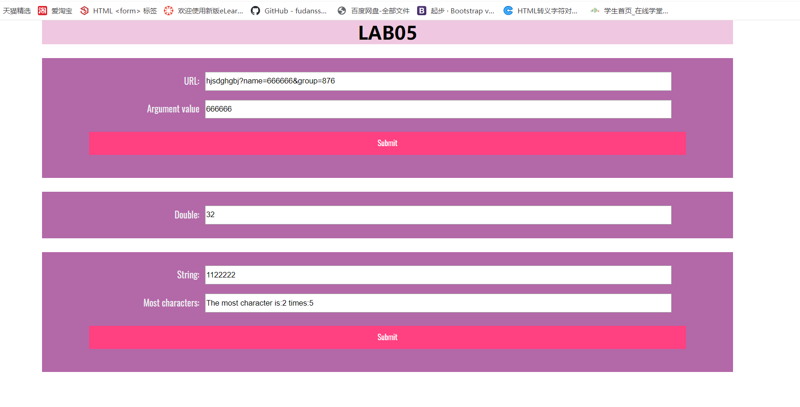
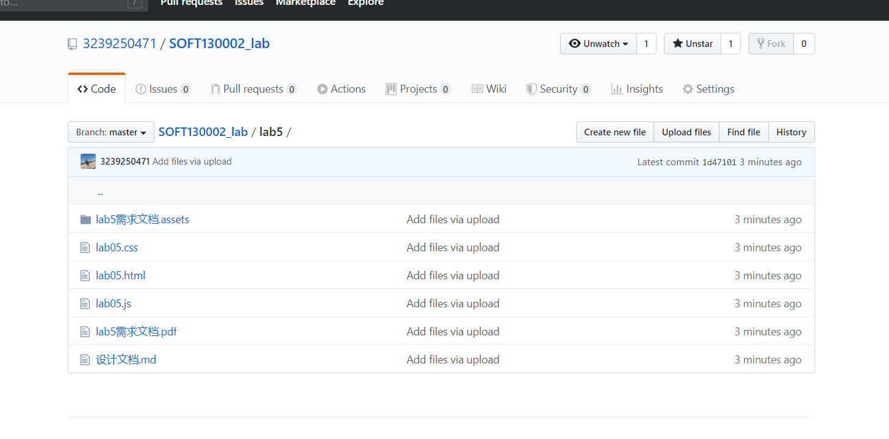

# Lab5设计文档

1. 知识点：正则表达式 文本框的赋值
 解决方案：利用正则表达式截取出name后的内容，然后将其赋给文本框

2. 知识点：clearInterval() setInterval()函数的应用
　　解决方案：先利用setInterval函数设定每5秒运行一次使文本框值增倍的函数，该函数第一次运行先给文本框赋值为1，之后再翻倍，之后在用clearInterval函数判断当运行时间到整分钟时或者运行10次时，执行该函数，使翻倍停止。

3. 知识点：函数的循环，
解决方案：先创建一个对象数组，通过遍历得到每个字符的出现次数，然后通过第二次遍历得到次数最多的字符，此字符和其出现次数即为所求。

